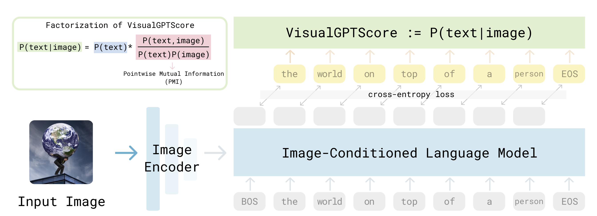

# VisualGPTScore: Visual Generative Pre-Training Score for Multimodal Reasoning
This codebase contains evaluation scripts for paper "Visio-Linguistic Reasoning with Multimodal Generative Pre-Training Scores". Code to be release soon!

